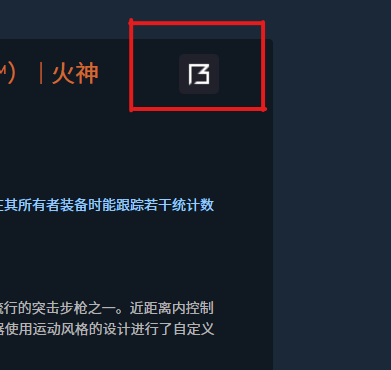

# Steam增强器

Steam增强器是一个提升Steam平台用户体验的浏览器脚本。它提供了以下主要功能：

## 功能特性

### 1. 界面放大
- **描述**: 放大Steam平台的大部分界面元素，使得浏览和操作更加清晰易读。
- **效果**: 提升视觉体验，特别适合需要高分辨率显示的用户。

### 2. CSGO市场详情页Buff价格对比及跳转
- **描述**: 在CS:GO市场详情页自动添加Buff平台的价格对比信息，并提供直接跳转链接。
- **效果**: 用户可以轻松查看当前Buff平台上相同物品的价格，并通过点击链接快速跳转到Buff网站进行购买。

### 3. 游戏详情页外部链接扩展
- **描述**: 在游戏详情页添加快捷跳转按钮，连接到小黑盒和SteamDB。
- **效果**: 帮助用户快速获取更多游戏相关信息、数据分析和社区讨论，丰富游戏体验。
- 可查看当前在线、今日峰值、历史峰值人数。

## 使用方法

1. 可以在浏览器``tampermonkey``扩展中或``Watt Toolkit(原Steam++)``安装此脚本
2. 安装完成后按下键盘``Ctrl+Alt+A``键即可弹出此对话框
3. 您可以自由移动此对话框；重置回Steam默认宽度

## 使用效果图
- 游戏详情页

- 评论区

- 库存

- 创意工坊

- 搜索页

- 详情页跳转按钮

- csgo市场增强
  - 
  - 
- ......
